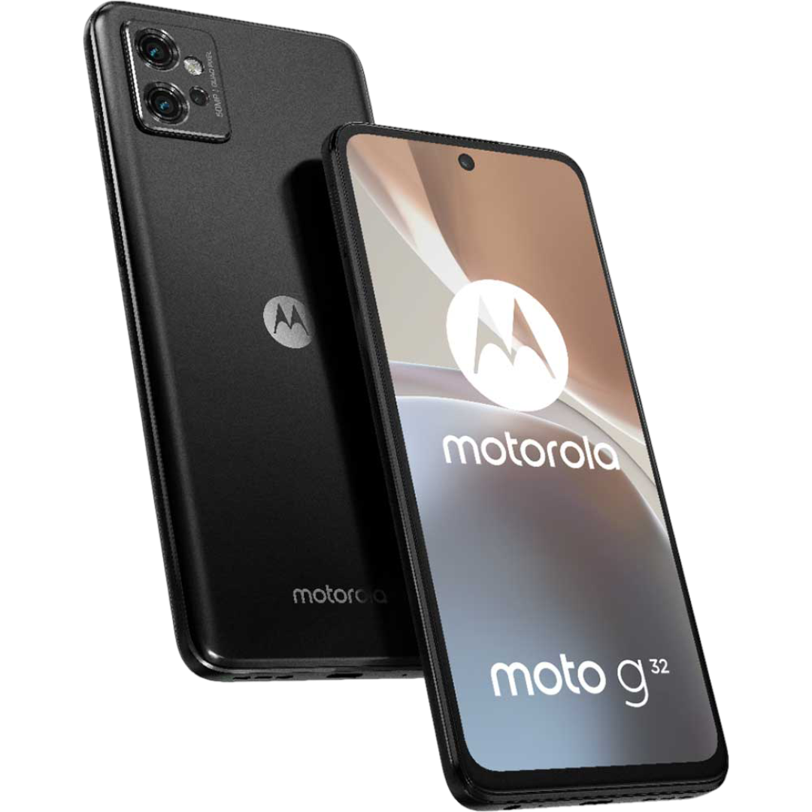

Device tree for Motorola Moto G32

```

SPDX-FileCopyrightText: 2022-2024 The LineageOS Project

SPDX-License-Identifier: Apache-2.0

```

## Device Specifications

Type | Specs
---:|:---
CPU | Octa-core (4x2.4 GHz Kryo 265 Gold & 4x1.8 GHz Kryo 265 Silver)       CHIPSET | Qualcomm SM6225 (codenamed "Khaje") Snapdragon 680 4G (6nm)
GPU | Adreno 610
Memory | 4/6/8GB LPDDR4X
Android Version | 12.0, upgradable to 13
Internal Storage | 64/128/256GB (UFS 2.2)
MicroSD | Up to 1TB (dedicated slot)
Battery | 5000 mAh
Dimensions | 161.8 x 73.8 x 8.5 mm (6.37 x 2.91 x 0.33 in)
Display | 1080 x 2400 pixels, 20:9 ratio (~405 ppi density)
Rear Camera | 50 MP, f/1.8 (wide), 1/2.76", 0.64µm, PDAF + 8 MP, f/2.2, 118˚ (ultrawide), 1/4.0", 1.12µm + 2 MP, f/2.4, (macro/depth)
Front Camera | 16 MP, f/2.4, (wide), 1.0µm


